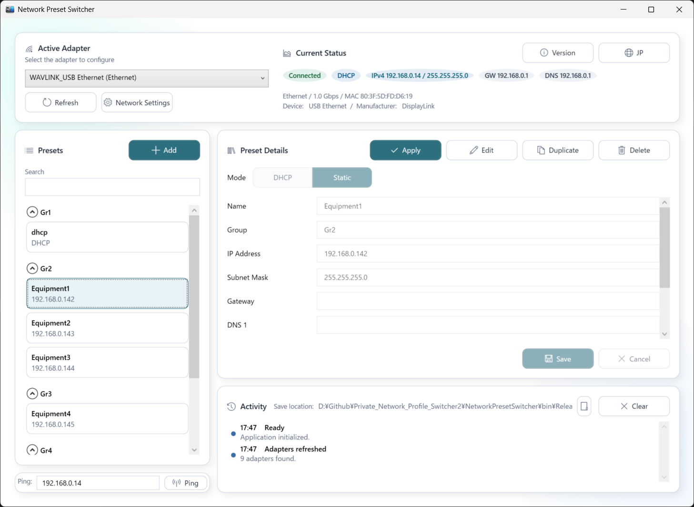

# NetworkPresetSwitcher



A WPF app for Windows to switch IP settings using presets.

## Features
- Switch between DHCP and static IP
- Create, edit, duplicate, delete presets
- Grouping with collapsible sections
- Activity log
- Ping execution
- English / Japanese UI toggle
- Presets saved in CSV (editable in Excel)

## Build
```
build.bat
```

Output:
`NetworkPresetSwitcher\bin\Release\net8.0-windows\win-x64\publish\NetworkPresetSwitcher.exe`

## CSV Format
Filename: `NetworkPresetSwitcher.csv`
Location: same folder as the exe

Header:
```
Type,Name,Group,IP,Subnet,Gateway,DNS1,DNS2,Comment,Language
```

Settings row:
```
Settings,,,,,,,,,"en-US" or "ja-JP"
```

Preset row:
```
Preset,Name,Group,IP,Subnet,Gateway,DNS1,DNS2,Comment,
```

Notes:
- UTF-8 BOM is recommended. If decoding fails, it falls back to CP932.
- If the header is tab-delimited, it is converted to commas (tabs inside quotes are preserved).
- If the CSV is open in Excel, saving will fail (error is shown).

## UI Notes
- Ping input is initialized with the selected adapter's IPv4 (manual edit is allowed).

---

# NetworkPresetSwitcher（日本語）


Windows で IP アドレス設定をプリセットから切り替える WPF アプリです。

## 主な機能
- DHCP / 固定 IP の切り替え
- プリセットの作成・編集・複製・削除
- グループ分け（折りたたみ可能）
- 操作ログの表示
- Ping 実行
- 日本語 / 英語 UI 切り替え
- CSV でプリセット保存（Excel で編集可能）

## ビルド
```
build.bat
```

出力先:
`NetworkPresetSwitcher\bin\Release\net8.0-windows\win-x64\publish\NetworkPresetSwitcher.exe`

## CSV 仕様
保存ファイル名: `NetworkPresetSwitcher.csv`
保存場所: exe と同じフォルダ

ヘッダー:
```
Type,Name,Group,IP,Subnet,Gateway,DNS1,DNS2,Comment,Language
```

Settings 行:
```
Settings,,,,,,,,,"en-US" または "ja-JP"
```

Preset 行:
```
Preset,Name,Group,IP,Subnet,Gateway,DNS1,DNS2,Comment,
```

メモ:
- UTF-8 BOM を推奨します。読み込みに失敗した場合は CP932 で再読込します。
- ヘッダーがタブ区切りの場合は自動でカンマに変換します（引用符内のタブは保持）。
- CSV が Excel で開かれている場合は保存できません（エラー表示あり）。

## UI メモ
- Ping 入力欄は選択中アダプタの IPv4 を初期値にします（手動編集も可）。
